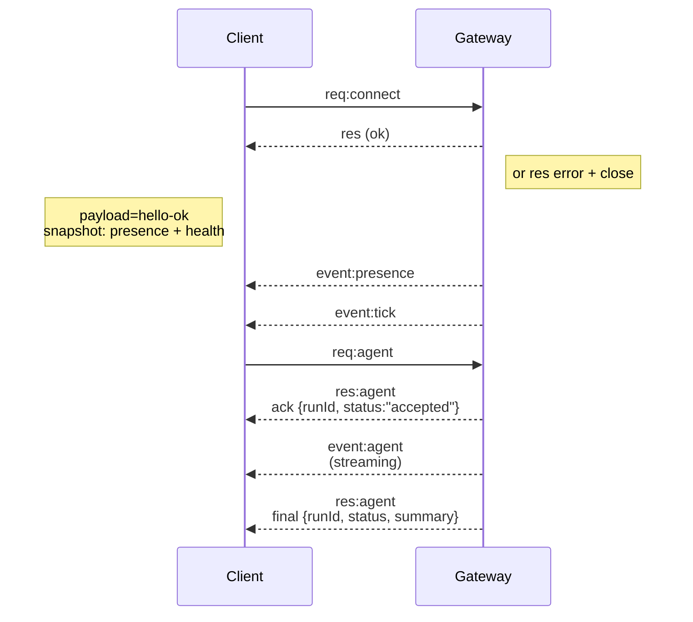

# Arsitektur Gateway

Terakhir diperbarui: 2026-01-22

## Gambaran Umum

- Satu **Gateway** yang berumur panjang memiliki semua permukaan perpesanan (WhatsApp via
  Baileys, Telegram via grammY, Slack, Discord, Signal, iMessage, WebChat).
- Klien control-plane (aplikasi macOS, CLI, web UI, otomatisasi) terhubung ke
  Gateway melalui **WebSocket** pada host bind yang dikonfigurasi (default
  `127.0.0.1:18789`).
- **Node** (macOS/iOS/Android/headless) juga terhubung melalui **WebSocket**, tetapi
  mendeklarasikan `role: node` dengan kemampuan/perintah eksplisit.
- Satu Gateway per host; ini adalah satu-satunya tempat yang membuka sesi WhatsApp.
- **Host canvas** dilayani oleh server HTTP Gateway di bawah:
  - `/__openclaw__/canvas/` (HTML/CSS/JS yang dapat diedit agen)
  - `/__openclaw__/a2ui/` (host A2UI)
    Menggunakan port yang sama dengan Gateway (default `18789`).

## Komponen dan alur

### Gateway (daemon)

- Memelihara koneksi penyedia.
- Mengekspos API WS bertipe (permintaan, respons, event server-push).
- Memvalidasi frame masuk terhadap Skema JSON.
- Memancarkan event seperti `agent`, `chat`, `presence`, `health`, `heartbeat`, `cron`.

### Klien (aplikasi mac / CLI / admin web)

- Satu koneksi WS per klien.
- Mengirim permintaan (`health`, `status`, `send`, `agent`, `system-presence`).
- Berlangganan event (`tick`, `agent`, `presence`, `shutdown`).

### Node (macOS / iOS / Android / headless)

- Terhubung ke **server WS yang sama** dengan `role: node`.
- Menyediakan identitas perangkat dalam `connect`; pairing berbasis **perangkat** (role `node`) dan
  persetujuan berada di penyimpanan pairing perangkat.
- Mengekspos perintah seperti `canvas.*`, `camera.*`, `screen.record`, `location.get`.

Detail protokol:

- [Protokol Gateway](/gateway/protocol)

### WebChat

- UI statis yang menggunakan API WS Gateway untuk riwayat chat dan pengiriman.
- Dalam pengaturan jarak jauh, terhubung melalui tunnel SSH/Tailscale yang sama dengan
  klien lainnya.

## Siklus hidup koneksi (klien tunggal)



## Protokol transmisi (ringkasan)

- Transportasi: WebSocket, frame teks dengan payload JSON.
- Frame pertama **harus** berupa `connect`.
- Setelah handshake:
  - Permintaan: `{type:"req", id, method, params}` → `{type:"res", id, ok, payload|error}`
  - Event: `{type:"event", event, payload, seq?, stateVersion?}`
- Jika `OPENCLAW_GATEWAY_TOKEN` (atau `--token`) diatur, `connect.params.auth.token`
  harus cocok atau soket akan ditutup.
- Kunci idempotensi diperlukan untuk metode yang memiliki efek samping (`send`, `agent`) agar
  dapat dicoba ulang dengan aman; server menyimpan cache deduplikasi berumur pendek.
- Node harus menyertakan `role: "node"` ditambah kemampuan/perintah/izin dalam `connect`.

## Pairing + Local Trust

- Semua klien WS (operator + node) menyertakan **identitas perangkat** pada `connect`.
- ID perangkat baru memerlukan persetujuan pairing; Gateway menerbitkan **token perangkat**
  untuk penghubungan berikutnya.
- Koneksi **Lokal** (loopback atau alamat tailnet host gateway sendiri) dapat
  disetujui secara otomatis untuk menjaga UX host-yang-sama tetap lancar.
- Koneksi **Non-lokal** harus menandatangani nonce `connect.challenge` dan memerlukan
  persetujuan eksplisit.
- Autentikasi Gateway (`gateway.auth.*`) tetap berlaku untuk **semua** koneksi, lokal atau
  jarak jauh.

Detail: [Protokol Gateway](/gateway/protocol), [Pairing](/id-ID/channels/pairing),
[Keamanan](/id-ID/gateway/security).

## Pengetikan protokol dan codegen

- Skema TypeBox mendefinisikan protokol.
- Skema JSON dihasilkan dari skema tersebut.
- Model Swift dihasilkan dari Skema JSON.

## Akses jarak jauh

- Disukai: Tailscale atau VPN.
- Alternatif: Tunnel SSH

  ```bash
  ssh -N -L 18789:127.0.0.1:18789 user@host
  ```

- Handshake + token autentikasi yang sama berlaku melalui tunnel.
- TLS + pinning opsional dapat diaktifkan untuk WS dalam pengaturan jarak jauh.

## Snapshot operasi

- Mulai: `openclaw gateway` (latar depan, log ke stdout).
- Kesehatan: `health` melalui WS (juga disertakan dalam `hello-ok`).
- Pengawasan: launchd/systemd untuk restart otomatis.

## Invarian

- Tepat satu Gateway mengontrol satu sesi Baileys per host.
- Handshake wajib dilakukan; frame pertama non-JSON atau non-connect apa pun adalah penutupan keras (hard close).
- Event tidak diulang; klien harus melakukan refresh pada celah (gaps).


