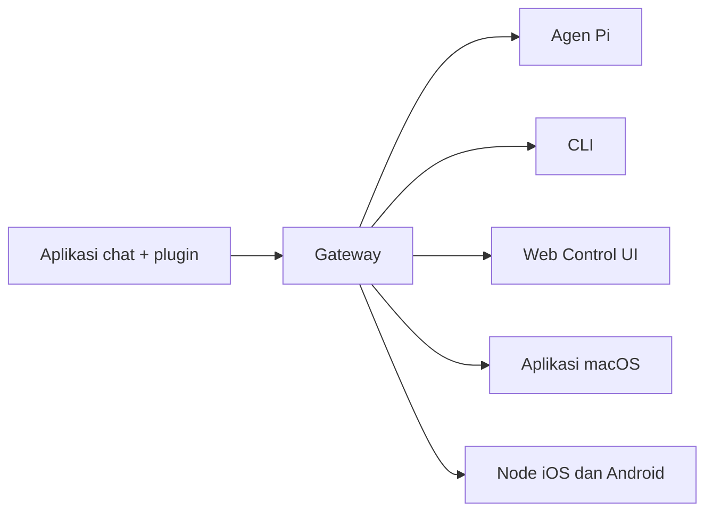

# OpenClaw 🦞

<p align="center">
    
    
</p>

> _"EKSFOLIASI! EKSFOLIASI!"_ — Mungkin kata seekor lobster luar angkasa

<p align="center">
  <strong>Gateway untuk segala OS bagi agen AI di WhatsApp, Telegram, Discord, iMessage, dan lainnya.</strong><br />
  Kirim pesan, dapatkan respons agen dari saku Anda. Plugin menambahkan Mattermost dan lainnya.
</p>

<Columns>
  <Card title="Panduan Memulai" href="/id-ID/start/getting-started" icon="rocket">
    Instal OpenClaw dan aktifkan Gateway dalam hitungan menit.
  </Card>
  <Card title="Jalankan Wizard" href="/id-ID/start/wizard" icon="sparkles">
    Setup terpandu dengan `openclaw onboard` dan alur pemasangan (pairing).
  </Card>
  <Card title="Buka Control UI" href="/web/control-ui" icon="layout-dashboard">
    Buka dashboard browser untuk chat, konfigurasi, dan sesi.
  </Card>
</Columns>

## Apa itu OpenClaw?

OpenClaw adalah **gateway mandiri (self-hosted)** yang menghubungkan aplikasi chat favorit Anda — WhatsApp, Telegram, Discord, iMessage, dan lainnya — ke agen AI coding seperti Pi. Anda menjalankan satu proses Gateway di mesin Anda sendiri (atau server), dan itu menjadi jembatan antara aplikasi perpesanan Anda dan asisten AI yang selalu tersedia.

**Untuk siapa ini?** Pengembang dan pengguna tingkat lanjut yang menginginkan asisten AI pribadi yang dapat dihubungi dari mana saja — tanpa melepaskan kontrol atas data mereka atau bergantung pada layanan pihak ketiga.

**Apa yang membuatnya berbeda?**

- **Mandiri (Self-hosted)**: berjalan di perangkat keras Anda, aturan Anda sendiri.
- **Multi-saluran**: satu Gateway melayani WhatsApp, Telegram, Discord, dan lainnya secara bersamaan.
- **Berbasis Agen**: dibangun untuk agen coding dengan penggunaan alat (tool use), sesi, memori, dan perutean multi-agen.
- **Sumber Terbuka**: berlisensi MIT, didorong oleh komunitas.

**Apa saja yang dibutuhkan?** Node 22+, kunci API (disarankan Anthropic), dan waktu 5 menit.

## Cara kerjanya



Gateway adalah satu-satunya sumber kebenaran untuk sesi, perutean (routing), dan koneksi saluran.

## Kemampuan utama

<Columns>
  <Card title="Gateway multi-saluran" icon="network">
    WhatsApp, Telegram, Discord, dan iMessage dengan satu proses Gateway saja.
  </Card>
  <Card title="Saluran plugin" icon="plug">
    Tambahkan Mattermost dan lainnya dengan paket ekstensi.
  </Card>
  <Card title="Perutean multi-agen" icon="route">
    Sesi terisolasi per agen, ruang kerja (workspace), atau pengirim.
  </Card>
  <Card title="Dukungan media" icon="image">
    Kirim dan terima gambar, audio, dan dokumen.
  </Card>
  <Card title="Web Control UI" icon="monitor">
    Dashboard browser untuk chat, konfigurasi, sesi, dan node.
  </Card>
  <Card title="Node seluler" icon="smartphone">
    Pasangkan node iOS dan Android dengan dukungan Canvas.
  </Card>
</Columns>

## Mulai Cepat

<Steps>
  <Step title="Instal OpenClaw">
    ```bash
    npm install -g openclaw@latest
    ```
  </Step>
  <Step title="Proses onboarding dan instal layanan">
    ```bash
    openclaw onboard --install-daemon
    ```
  </Step>
  <Step title="Login WhatsApp dan jalankan Gateway">
    ```bash
    openclaw channels login
    openclaw gateway --port 18789
    ```
  </Step>
</Steps>

Butuh panduan instalasi lengkap dan setup pengembangan? Lihat [Mulai Cepat](/id-ID/start/getting-started).

## Dashboard

Buka Control UI di browser setelah Gateway berjalan.

- Default lokal: [http://127.0.0.1:18789/](http://127.0.0.1:18789/)
- Akses jarak jauh: [Halaman Web](/web) dan [Tailscale](/gateway/tailscale)

<p align="center">
  
</p>

## Konfigurasi (opsional)

Konfigurasi disimpan di `~/.openclaw/openclaw.json`.

- Jika Anda **tidak melakukan apa-apa**, OpenClaw menggunakan binary Pi bawaan dalam mode RPC dengan sesi per-pengirim.
- Jika Anda ingin membatasinya, mulailah dengan `channels.whatsapp.allowFrom` dan (untuk grup) aturan penyebutan (mention).

Contoh:

```json5
{
  channels: {
    whatsapp: {
      allowFrom: ["+15555550123"],
      groups: { "*": { requireMention: true } },
    },
  },
  messages: { groupChat: { mentionPatterns: ["@openclaw"] } },
}
```

## Mulai dari sini

<Columns>
  <Card title="Hub Dokumentasi" href="/start/hubs" icon="book-open">
    Semua dokumen dan panduan, disusun berdasarkan kasus penggunaan.
  </Card>
  <Card title="Konfigurasi" href="/gateway/configuration" icon="settings">
    Pengaturan inti Gateway, token, dan konfigurasi penyedia.
  </Card>
  <Card title="Akses Jarak Jauh" href="/gateway/remote" icon="globe">
    Pola akses SSH dan tailnet.
  </Card>
  <Card title="Saluran" href="/channels/telegram" icon="message-square">
    Setup spesifik saluran untuk WhatsApp, Telegram, Discord, dan lainnya.
  </Card>
  <Card title="Node" href="/nodes" icon="smartphone">
    Node iOS dan Android dengan pairing dan Canvas.
  </Card>
  <Card title="Bantuan" href="/help" icon="life-buoy">
    Perbaikan umum dan titik masuk pemecahan masalah.
  </Card>
</Columns>

## Pelajari lebih lanjut

<Columns>
  <Card title="Daftar fitur lengkap" href="/concepts/features" icon="list">
    Kemampuan lengkap saluran, perutean, dan media.
  </Card>
  <Card title="Perutean multi-agen" href="/concepts/multi-agent" icon="route">
    Isolasi ruang kerja dan sesi per agen.
  </Card>
  <Card title="Keamanan" href="/gateway/security" icon="shield">
    Token, daftar izinkan (allowlist), dan kontrol keamanan.
  </Card>
  <Card title="Pemecahan Masalah" href="/gateway/troubleshooting" icon="wrench">
    Diagnostik Gateway dan kesalahan umum.
  </Card>
  <Card title="Tentang dan Kredit" href="/reference/credits" icon="info">
    Asal-usul proyek, kontributor, dan lisensi.
  </Card>
</Columns>
