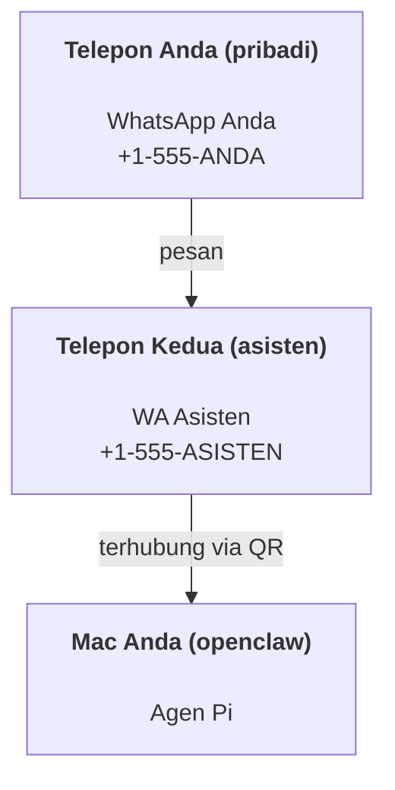

# Membangun asisten pribadi dengan OpenClaw

OpenClaw adalah gateway WhatsApp + Telegram + Discord + iMessage untuk agen **Pi**. Plugin menambahkan Mattermost. Panduan ini menjelaskan pengaturan "asisten pribadi": satu nomor WhatsApp khusus yang berperan sebagai agen Anda yang selalu aktif.

## ⚠️ Keamanan diutamakan

Anda menempatkan agen pada posisi untuk dapat:

- menjalankan perintah di mesin Anda (tergantung pada pengaturan alat Pi Anda)
- membaca/menulis file di workspace Anda
- mengirim pesan keluar melalui WhatsApp/Telegram/Discord/Mattermost (plugin)

Mulailah dengan konservatif:

- Selalu atur `channels.whatsapp.allowFrom` (jangan pernah menjalankan sistem yang terbuka untuk umum di Mac pribadi Anda).
- Gunakan nomor WhatsApp khusus untuk asisten.
- Heartbeat sekarang diatur secara default setiap 30 menit. Nonaktifkan sampai Anda mempercayai pengaturannya dengan mengatur `agents.defaults.heartbeat.every: "0m"`.

## Prasyarat

- OpenClaw sudah terinstal dan sudah melalui proses onboarding — lihat [Panduan Memulai](/id-ID/start/getting-started) jika Anda belum melakukannya.
- Nomor telepon kedua (SIM/eSIM/prepaid) untuk asisten.

## Pengaturan dua telepon (direkomendasikan)

Idealnya seperti ini:



Jika Anda menghubungkan WhatsApp pribadi Anda ke OpenClaw, setiap pesan yang masuk kepada Anda akan menjadi "input agen". Hal tersebut biasanya bukan yang Anda inginkan.

## Mulai cepat 5 menit

1. Pasangkan WhatsApp Web (tampilkan QR; pindai dengan telepon asisten):

```bash
openclaw channels login
```

2. Jalankan Gateway (biarkan terus berjalan):

```bash
openclaw gateway --port 18789
```

3. Masukkan konfigurasi minimal di `~/.openclaw/openclaw.json`:

```json5
{
  channels: { whatsapp: { allowFrom: ["+15555550123"] } },
}
```

Sekarang kirim pesan ke nomor asisten dari telepon Anda yang sudah masuk daftar izin (allowlist).

Ketika proses onboarding selesai, kami akan membuka dashboard secara otomatis dan mencetak tautan yang bersih (tanpa token). Jika diminta autentikasi, tempelkan token dari `gateway.auth.token` ke pengaturan Control UI. Untuk membuka kembali nanti: `openclaw dashboard`.

## Memberikan workspace bagi agen (AGENTS)

OpenClaw membaca instruksi operasi dan "memori" dari direktori workspace-nya.

Secara default, OpenClaw menggunakan `~/.openclaw/workspace` sebagai workspace agen, dan akan membuatnya secara otomatis (ditambah file awal `AGENTS.md`, `SOUL.md`, `TOOLS.md`, `IDENTITY.md`, `USER.md`, `HEARTBEAT.md`) pada saat pengaturan/jalankan agen pertama kali. `BOOTSTRAP.md` hanya dibuat ketika workspace masih benar-benar baru (file ini tidak akan muncul lagi setelah Anda menghapusnya). `MEMORY.md` bersifat opsional (tidak dibuat otomatis); jika ada, file ini akan dimuat untuk sesi normal. Sesi sub-agen hanya menyertakan `AGENTS.md` dan `TOOLS.md`.

Tip: perlakukan folder ini seperti "memori" OpenClaw dan buatlah menjadi repo git (idealnya privat) agar file `AGENTS.md` + memori Anda tercadangkan. Jika git terinstal, workspace yang baru akan diinisialisasi secara otomatis.

```bash
openclaw setup
```

Tata letak workspace lengkap + panduan cadangan: [Workspace agen](/id-ID/concepts/agent-workspace)
Alur kerja memori: [Memori](/id-ID/concepts/memory)

Opsional: pilih workspace yang berbeda dengan `agents.defaults.workspace` (mendukung `~`).

```json5
{
  agent: {
    workspace: "~/.openclaw/workspace",
  },
}
```

Jika Anda sudah memiliki file workspace sendiri dari sebuah repo, Anda dapat menonaktifkan pembuatan file bootstrap sepenuhnya:

```json5
{
  agent: {
    skipBootstrap: true,
  },
}
```

## Konfigurasi yang mengubahnya menjadi “asisten”

OpenClaw secara default sudah memiliki pengaturan asisten yang baik, namun Anda mungkin ingin menyesuaikannya:

- persona/instruksi di `SOUL.md`
- pengaturan default "thinking" (jika diinginkan)
- detak jantung/heartbeat (setelah Anda mempercayainya)

Contoh:

```json5
{
  logging: { level: "info" },
  agent: {
    model: "anthropic/claude-opus-4-6",
    workspace: "~/.openclaw/workspace",
    thinkingDefault: "high",
    timeoutSeconds: 1800,
    // Mulai dengan 0; aktifkan nanti.
    heartbeat: { every: "0m" },
  },
  channels: {
    whatsapp: {
      allowFrom: ["+15555550123"],
      groups: {
        "*": { requireMention: true },
      },
    },
  },
  routing: {
    groupChat: {
      mentionPatterns: ["@openclaw", "openclaw"],
    },
  },
  session: {
    scope: "per-sender",
    resetTriggers: ["/new", "/reset"],
    reset: {
      mode: "daily",
      atHour: 4,
      idleMinutes: 10080,
    },
  },
}
```

## Sesi dan Memori

- File sesi: `~/.openclaw/agents/<agentId>/sessions/{{SessionId}}.jsonl`
- Metadata sesi (penggunaan token, rute terakhir, dll): `~/.openclaw/agents/<agentId>/sessions/sessions.json` (legacy: `~/.openclaw/sessions/sessions.json`)
- `/new` atau `/reset` memulai sesi baru untuk chat tersebut (dapat dikonfigurasi melalui `resetTriggers`). Jika dikirim sendirian, agen akan membalas dengan salam singkat untuk mengonfirmasi reset.
- `/compact [instruksi]` memadatkan konteks sesi dan melaporkan sisa anggaran konteks.

## Heartbeats (mode proaktif)

Secara default, OpenClaw menjalankan heartbeat setiap 30 menit dengan prompt:
`Read HEARTBEAT.md if it exists (workspace context). Follow it strictly. Do not infer or repeat old tasks from prior chats. If nothing needs attention, reply HEARTBEAT_OK.`
Atur `agents.defaults.heartbeat.every: "0m"` untuk menonaktifkan.

- Jika `HEARTBEAT.md` ada tetapi isinya kosong (hanya baris kosong dan header markdown seperti `# Heading`), OpenClaw akan melewatkan jalannya heartbeat untuk menghemat panggilan API.
- Jika file tersebut tidak ada, heartbeat tetap berjalan dan model akan memutuskan apa yang harus dilakukan.
- Jika agen membalas dengan `HEARTBEAT_OK` (opsional dengan padding singkat; lihat `agents.defaults.heartbeat.ackMaxChars`), OpenClaw akan menahan pengiriman keluar untuk heartbeat tersebut.
- Heartbeat menjalankan giliran agen secara penuh — interval yang lebih pendek akan menghabiskan lebih banyak token.

```json5
{
  agent: {
    heartbeat: { every: "30m" },
  },
}
```

## Media masuk dan keluar

Lampiran masuk (gambar/audio/dokumen) dapat ditampilkan ke perintah Anda melalui templat:

- `{{MediaPath}}` (jalur file temp lokal)
- `{{MediaUrl}}` (pseudo-URL)
- `{{Transcript}}` (jika transkripsi audio diaktifkan)

Lampiran keluar dari agen: sertakan `MEDIA:<path-or-url>` pada baris tersendiri (tanpa spasi). Contoh:

```
Ini tangkapan layarnya.
MEDIA:https://example.com/screenshot.png
```

OpenClaw akan mengekstrak hal ini dan mengirimkannya sebagai media bersama teks.

## Daftar periksa operasi (Operations checklist)

```bash
openclaw status          # status lokal (kredensial, sesi, event yang antre)
openclaw status --all    # diagnosis lengkap (read-only, dapat ditempel)
openclaw status --deep   # menambahkan pemeriksaan kesehatan gateway (Telegram + Discord)
openclaw health --json   # snapshot kesehatan gateway (WS)
```

Log tersimpan di bawah `/tmp/openclaw/` (default: `openclaw-YYYY-MM-DD.log`).

## Langkah berikutnya

- WebChat: [WebChat](/id-ID/web/webchat)
- Operasi Gateway: [Runbook Gateway](/id-ID/gateway)
- Cron + wakeups: [Cron jobs](/id-ID/automation/cron-jobs)
- Pendamping menu bar macOS: [Aplikasi macOS OpenClaw](/id-ID/platforms/macos)
- Aplikasi node iOS: [Aplikasi iOS](/id-ID/platforms/ios)
- Aplikasi node Android: [Aplikasi Android](/id-ID/platforms/android)
- Status Windows: [Windows (WSL2)](/id-ID/platforms/windows)
- Status Linux: [Aplikasi Linux](/id-ID/platforms/linux)
- Keamanan: [Keamanan](/id-ID/gateway/security)


